# GLSim — Cervical Cancer Cell Classification

Application of the **GLSim** (Global-Local Similarity) method with **ViT-B/16** for classifying cervical cells in the **SIPaKMeD / Herlev Cervical Cancer** dataset.

---

## Authors

**Ivan Igor Antunes Neves** · **Alfa Marine** · **Evelin Helena Cardoso Gomes** · **Carlos Renato Lisboa Francês** · **Jasmine Priscyla Leite de Araújo**

¹Laboratory of Artificial Intelligence Applied to Smart Cities (LABCITY), Universidade Federal do Pará, Belém
ivan.neves@itec.ufpa.br · evelincardoso@ufpa.br · rfrances@ufpa.br · jasmine@ufpa.br

---

## Dataset

**Source:** [Kaggle — Cervical Cancer Largest Dataset SIPaKMeD](https://www.kaggle.com/datasets/prahladmehandiratta/cervical-cancer-largest-dataset-sipakmed?select=im_Koilocytotic)

The SIPaKMeD dataset contains microscopic images of individually segmented cervical cells (`CROPPED` folder), organized into 5 clinical classes:

| ID | Class | Type | Description |
|----|-------|------|-------------|
| 0 | **Dyskeratotic** | Abnormal | Pre-cancerous cells with premature keratinization |
| 1 | **Koilocytotic** | Abnormal | Indicates HPV infection (perinuclear halo) |
| 2 | **Metaplastic** | Normal | Transition cells (epithelium / endocervix) |
| 3 | **Parabasal** | Normal | Immature normal cells (deep layer) |
| 4 | **Superficial-Intermediate** | Normal | Mature normal surface cells |

### Dataset Statistics

| Split | Images | Dyskeratotic | Koilocytotic | Metaplastic | Parabasal | Sup.-Interm. |
|-------|--------|-------------|-------------|------------|----------|--------------|
| **Train** (70%) | 2,841 | 571 | 579 | 557 | 551 | 583 |
| **Val** (15%) | 604 | 121 | 123 | 118 | 118 | 124 |
| **Test** (15%) | 604 | 121 | 123 | 118 | 118 | 124 |
| **Total** | **4,049** | **813** | **825** | **793** | **787** | **831** |

- **Image type:** BMP, RGB, ~109×112 px (individually segmented CROPPED cells)
- **Split:** stratified by class (70/15/15), seed `42`
- **Training run:** uses `train + val` (3,445 images), evaluated on `test` (604 images)

---

## Method — GLSim

**GLSim** (Global-Local Similarity) is a fine-grained visual recognition method based on Vision Transformers. Its core mechanism automatically extracts a discriminative local crop guided by the cosine similarity between the global `[CLS]` token and the local patch tokens.

```
Image → Patch Embedding → ViT Encoder
      ↓
   [CLS] global  ←→  patch tokens
      ↓  cosine similarity
   Top-K patches → crop → ViT Encoder (crop)
      ↓
   Concat [global + local] → Aggregator → Classifier
```

**Reference:** GLSim — *Global-Local Similarity for Fine-Grained Recognition* (ViT-B/16 backbone)
**Source code:** [https://github.com/arkel23/GLSim.git](https://github.com/arkel23/GLSim.git)

---

## Exploratory Data Analysis (EDA)

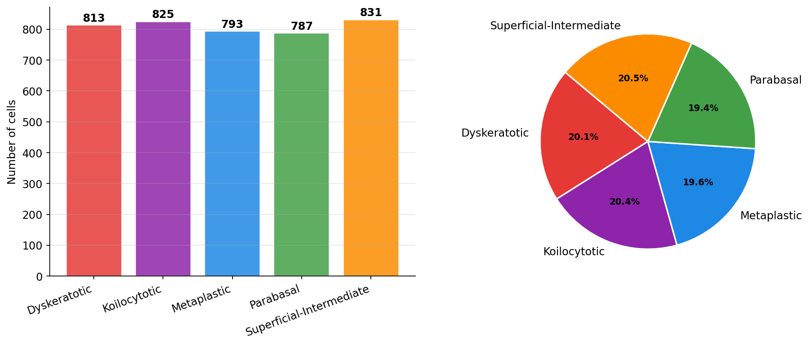

**Class distribution.** The bar chart shows the absolute count of CROPPED cell images per class, while the pie chart shows the relative proportion. The dataset is nearly balanced across the five classes, with a total of 4,049 cells. Dyskeratotic and Koilocytotic (abnormal cells) together account for approximately 40% of the data.

---

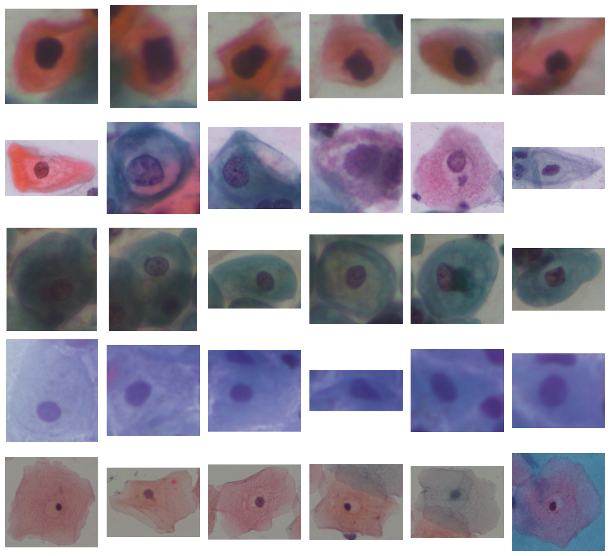

**Sample images per class.** Each row displays six representative cells from one class, providing a visual reference for the morphological differences between categories. Parabasal cells are notably smaller and rounder, while Superficial-Intermediate cells tend to have larger, flatter cytoplasm. Koilocytotic cells exhibit the characteristic perinuclear halo associated with HPV infection.

---

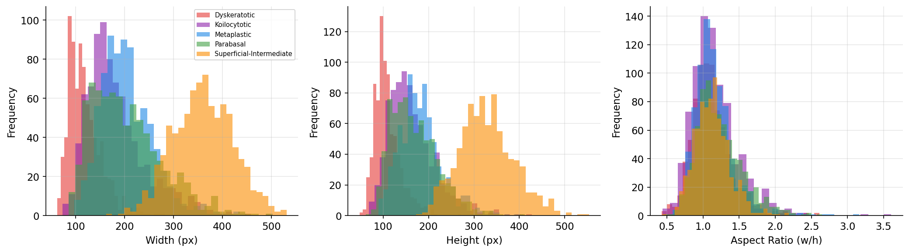

**Image dimension distribution.** Histograms of width, height, and aspect ratio across all 4,049 CROPPED images. The majority of cells fall in the 80–140 px range for both dimensions, reflecting the relatively uniform segmentation of individual cells. The aspect ratio is concentrated near 1.0, indicating that most cells are approximately square.

---

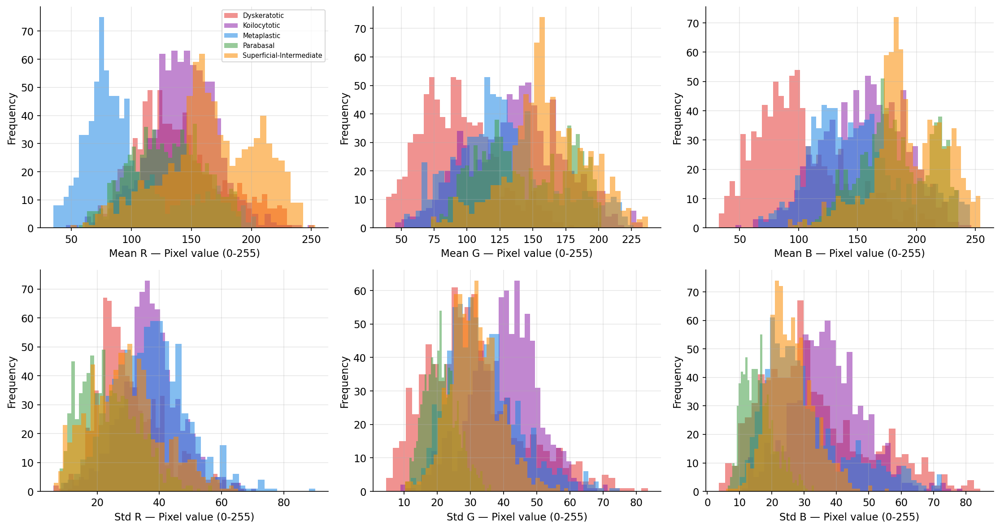

**RGB channel distributions by class.** Histograms of the per-image mean and standard deviation for each RGB channel, separated by class. Classes with higher staining intensity (Dyskeratotic, Koilocytotic) tend to show distinct peaks in the red and blue channels, while normal classes (Parabasal, Superficial-Intermediate) exhibit broader, more uniform distributions.

---

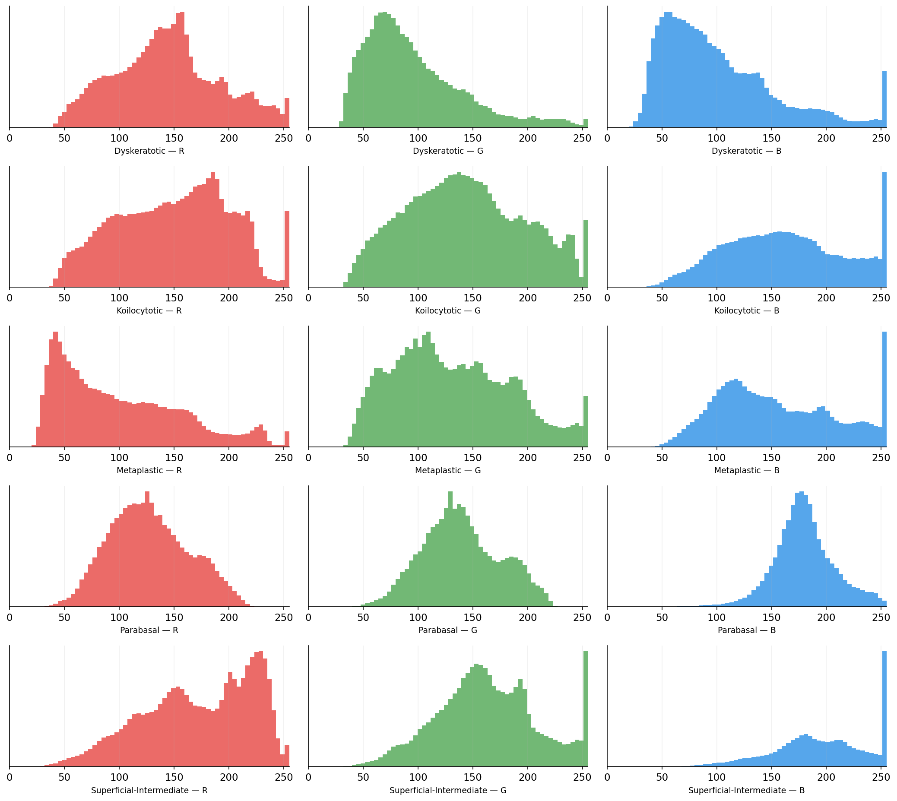

**Color histograms per class (RGB).** Pixel-level intensity histograms for the R, G, and B channels, computed from a random sample of 150 images per class. Each row corresponds to one class. The shape and position of each histogram reflect class-specific staining patterns, which are one of the primary discriminative cues exploited by the model.

---

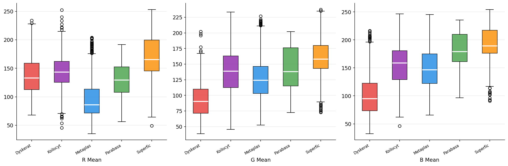

**Mean RGB values per class.** Boxplots of the average red, green, and blue channel values across all images in each class. Parabasal cells display consistently lower mean values across channels (darker staining), while Superficial-Intermediate cells tend to have higher means (lighter background). These differences in channel means provide strong class-separating signals for the classifier.

---

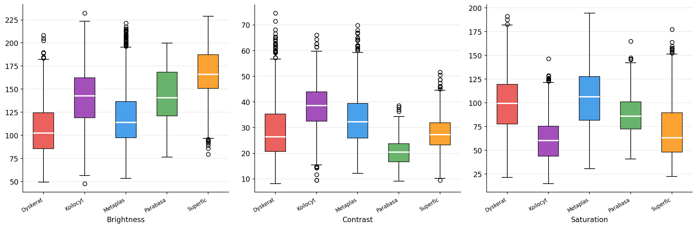

**Brightness, contrast, and saturation per class.** Boxplots of three perceptual features: overall brightness (grayscale mean), contrast (grayscale standard deviation), and color saturation (HSV S-channel mean). Dyskeratotic and Koilocytotic cells exhibit higher saturation due to denser cytoplasmic staining, while Parabasal cells show the lowest brightness values, consistent with their compact, darkly stained nuclei.

---

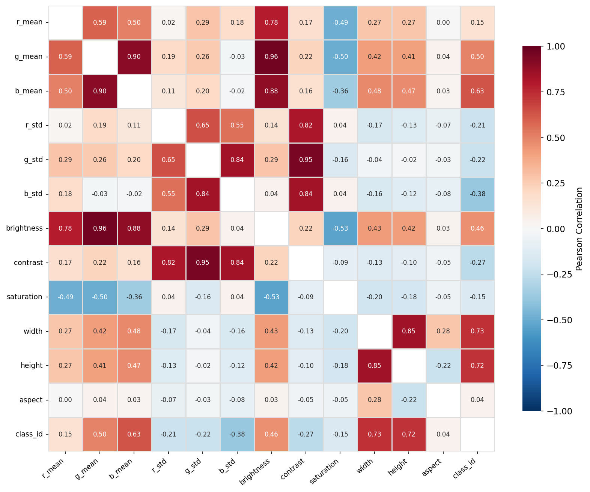

**Pearson correlation matrix.** Pairwise correlations between all extracted image features and `class_id`. Strong positive correlations appear between brightness and the RGB means, as expected. The `class_id` column reveals which features carry the most discriminative information: brightness, saturation, and the red channel mean show the highest correlation with the target class.

---

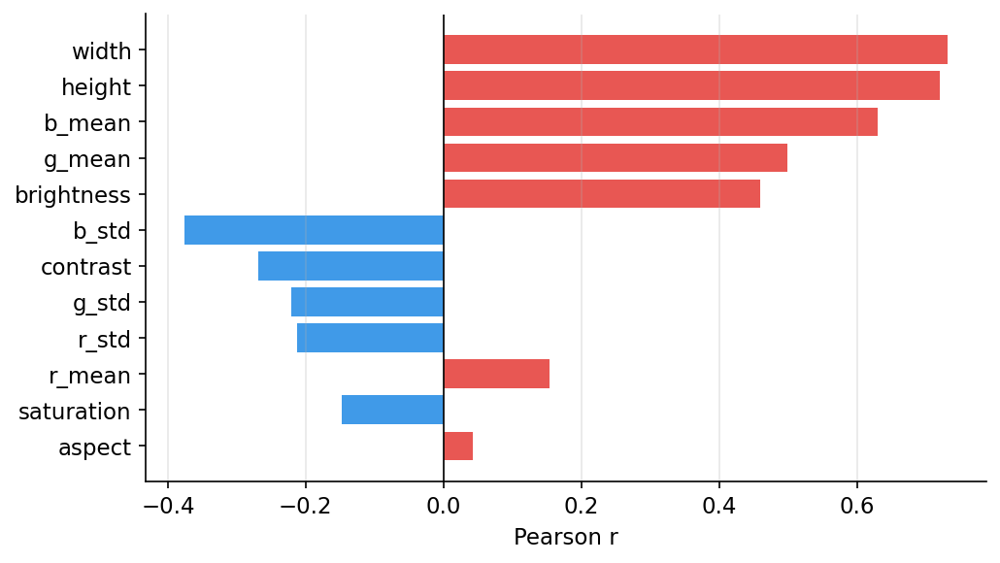

**Feature correlation with class_id (ranked).** Horizontal bar chart ranking each feature by its absolute Pearson correlation with the class label. Red bars indicate positive correlation (feature value increases with class_id) and blue bars indicate negative correlation. Brightness and saturation emerge as the most informative hand-crafted features for distinguishing between the five classes.

---

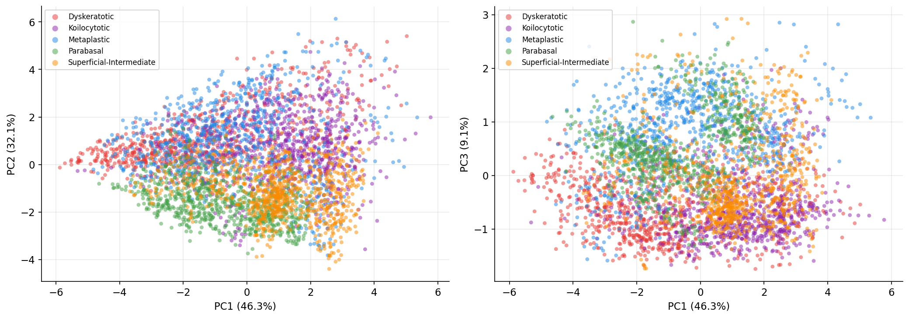

**PCA of color/texture features.** Two scatter plots projecting the 9-dimensional feature space onto the first three principal components (PC1 vs PC2 and PC1 vs PC3). Each point represents one cell image, colored by class. The variance explained by each component is shown on the axis labels. Although the classes partially overlap in this low-dimensional projection, Parabasal and Superficial-Intermediate cells show the clearest separation along PC1.

---

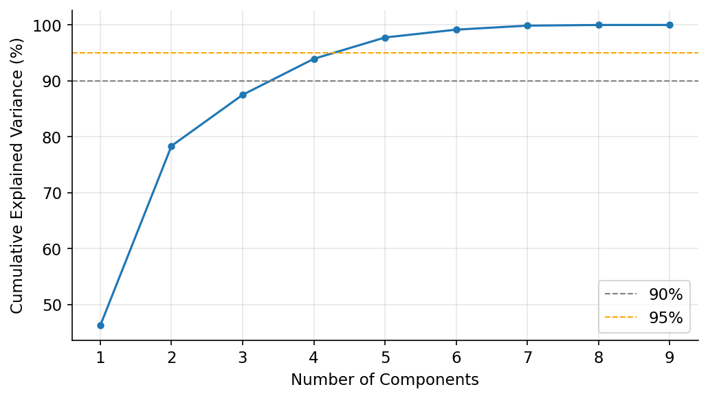

**Cumulative explained variance (PCA).** The curve shows how much total variance is captured as the number of principal components increases. The dashed lines mark the 90% and 95% thresholds. The first 3–4 components already explain over 90% of the variance in the hand-crafted feature set, indicating that the color and texture space is relatively low-dimensional.

---

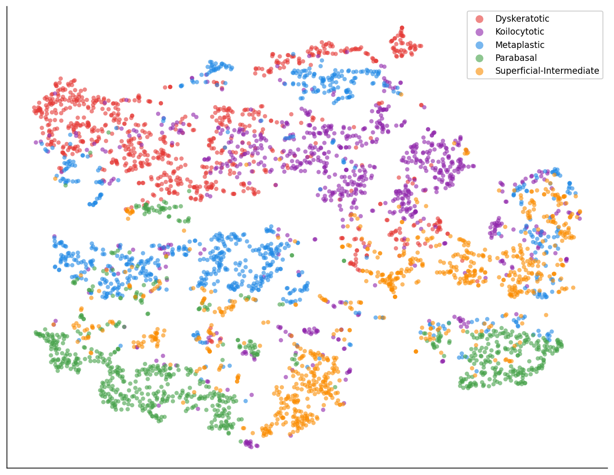

**t-SNE projection.** A non-linear 2D embedding of all 4,049 cells using t-SNE (perplexity=40). Points are colored by class. t-SNE reveals local cluster structure that is not visible in PCA: Parabasal cells form a compact, well-separated cluster, while Koilocytotic and Metaplastic cells show more overlap — consistent with the model's slightly lower F1 scores for those two classes.

---

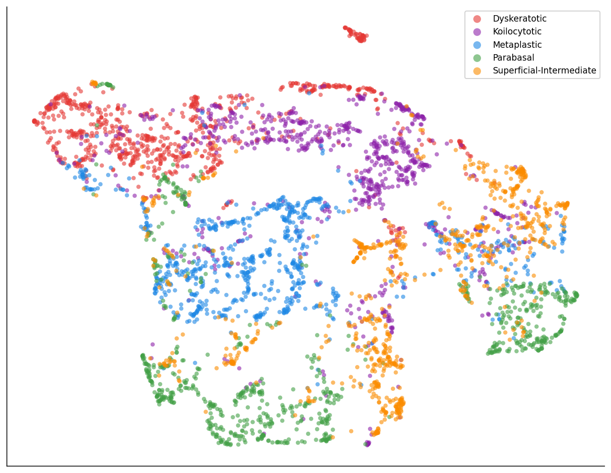

**UMAP projection.** An alternative non-linear 2D embedding using UMAP (n_neighbors=20, min_dist=0.1). UMAP better preserves global structure compared to t-SNE. The five classes form distinct but adjacent regions, with Dyskeratotic and Koilocytotic (both abnormal) appearing closer to each other than to the normal classes, reflecting their shared pathological origin.

---

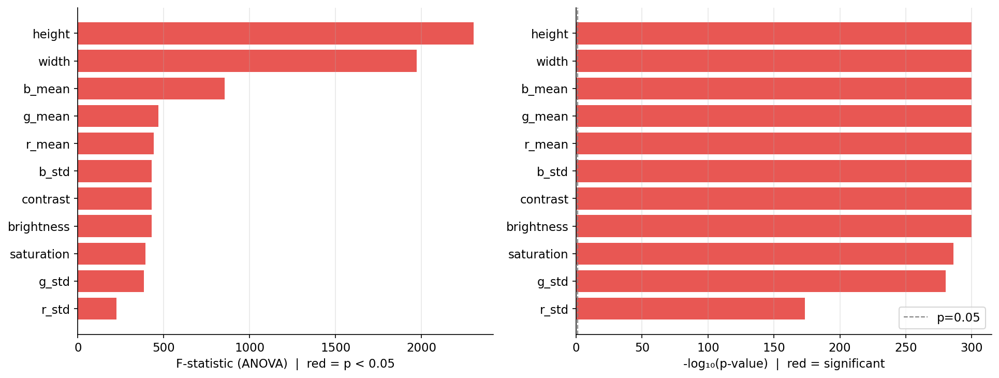

**ANOVA test — class differences by feature.** One-way ANOVA was applied to each feature across the five class groups. The left panel shows the F-statistic (higher = stronger between-class differences), and the right panel shows the −log₁₀(p-value). All features are statistically significant (p < 0.05, shown in red), confirming that every extracted feature carries discriminative information about the class label.

---

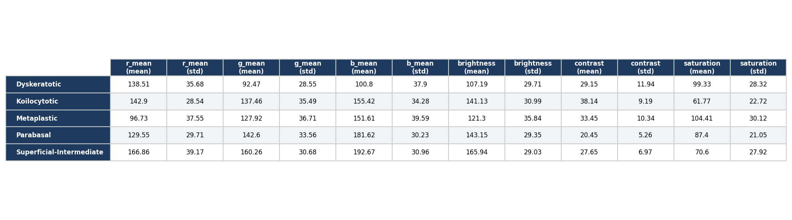

**Per-class descriptive statistics.** A table summarizing the mean and standard deviation of the six most informative features (R mean, G mean, B mean, brightness, contrast, saturation) broken down by class. This provides a compact numerical view of the inter-class differences highlighted in the boxplots and ANOVA results.

---

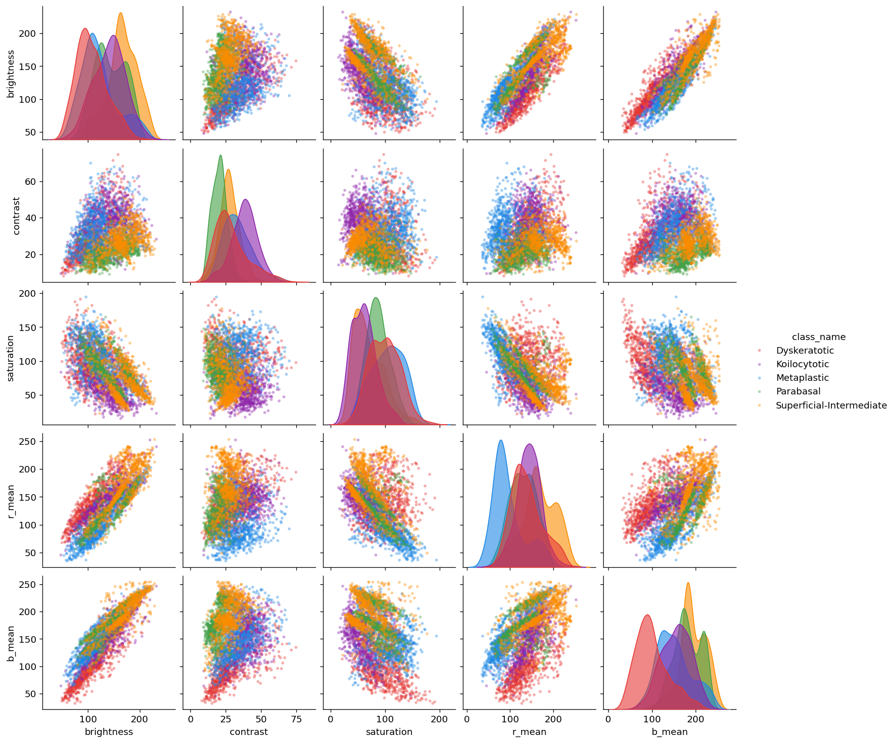

**Pairplot of color and texture features.** A matrix of scatter plots and KDE curves for five key features: brightness, contrast, saturation, red mean, and blue mean. Each off-diagonal cell shows the joint distribution of two features colored by class, while diagonal cells show per-class KDE curves. The pairplot reveals that no single pair of features perfectly separates all five classes, motivating the use of a deep learning model that operates on raw pixels rather than hand-crafted statistics.

---

## Experiment 1 — CROPPED Cells (Segmented)

Training on 4,049 individually segmented cell images (~109×112 px). Each image contains exactly one cervical cell isolated from its slide, providing a clean and focused input for classification.

| Metric | Value |
|--------|-------|
| **Top-1 Accuracy** | **96.19%** |
| **F1 Score (macro)** | 0.9618 |
| **F1 Score (weighted)** | 0.9618 |
| **Precision (macro)** | 0.9625 |
| **Recall (macro)** | 0.9621 |
| **AUC ROC (macro)** | **0.9978** |

| Class | Precision | Recall | F1-Score | Support |
|-------|-----------|--------|----------|---------|
| Dyskeratotic | 0.99 | 0.99 | 0.99 | 121 |
| Koilocytotic | 0.96 | 0.89 | 0.92 | 123 |
| Metaplastic | 0.90 | 0.95 | 0.92 | 118 |
| Parabasal | 1.00 | 0.99 | 1.00 | 118 |
| Superficial-Intermediate | 0.97 | 0.99 | 0.98 | 124 |

**Best epoch:** 42/50 · **Training time:** ~206 min (~4.1 min/epoch) · **VRAM:** 4.57 GB

---

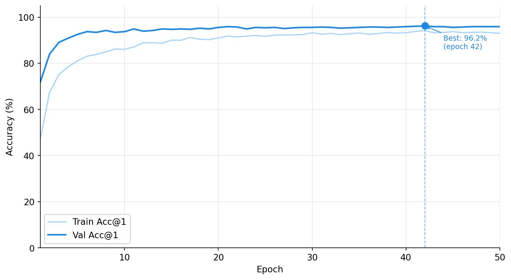

**Train vs. Validation accuracy per epoch — CROPPED model.** The blue line tracks validation accuracy and the lighter line tracks training accuracy across all 50 epochs. The model converges rapidly, reaching above 90% validation accuracy by epoch 5. The dashed vertical line marks the best validation epoch (42), where the checkpoint was saved. The close alignment between train and val curves indicates minimal overfitting, supported by the use of label smoothing, stochastic depth, and random erasing.

---

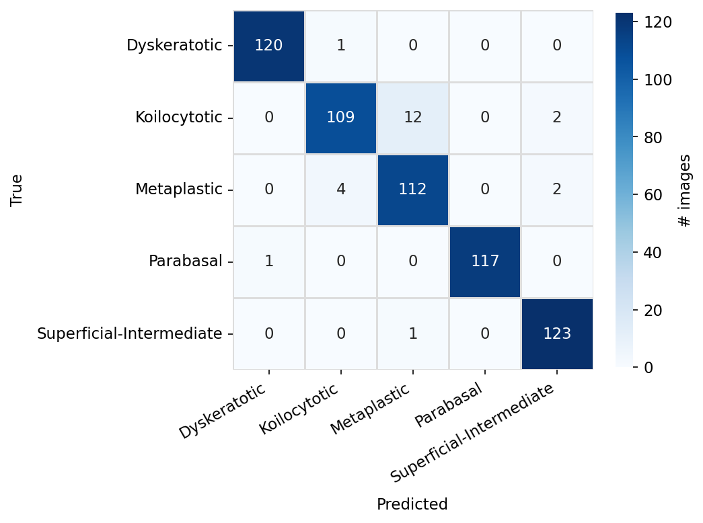

**Confusion matrix (absolute counts).** Each cell shows the number of test images predicted as class *column* given true class *row*. The diagonal entries are correct predictions. The model makes virtually no errors between abnormal and normal categories; the few misclassifications occur between Koilocytotic and Metaplastic cells, which share subtle morphological features.

---

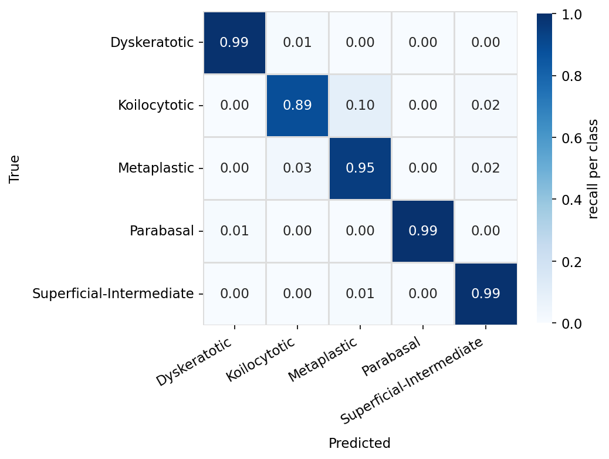

**Normalized confusion matrix (recall per class).** Each row is normalized by the total number of true samples in that class, so diagonal values represent per-class recall. Parabasal achieves 100% recall, and Dyskeratotic reaches 99%. Koilocytotic has the lowest recall at 89%, indicating it is the most challenging class — several of its cells are misclassified as Metaplastic.

---

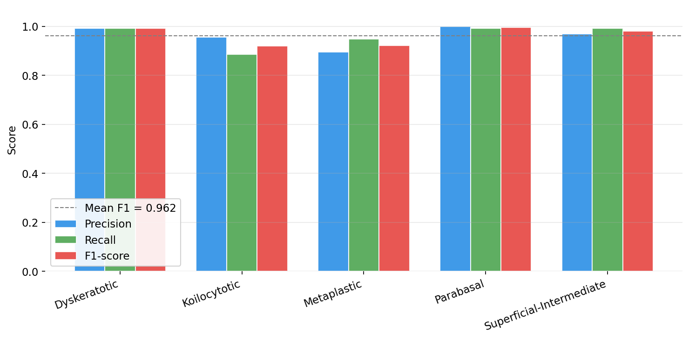

**Precision, Recall, and F1-Score per class.** Grouped bar chart comparing the three metrics side by side for each class. The dashed line marks the macro-averaged F1 score (0.9618). All classes exceed 0.90 on all three metrics. Koilocytotic and Metaplastic show the most room for improvement, reflecting their visual similarity and the slightly lower recall for Koilocytotic.

---

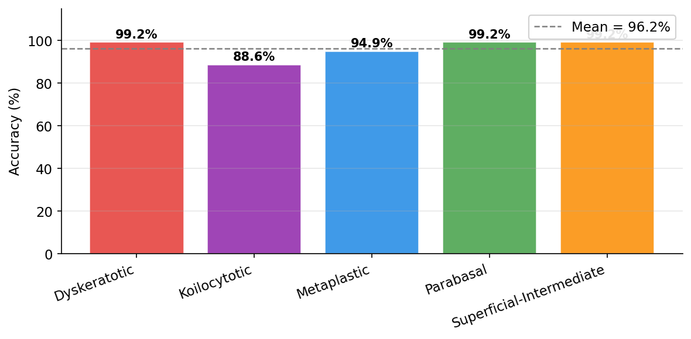

**Per-class accuracy.** Bar chart of the fraction of correctly classified samples for each class. Parabasal achieves perfect accuracy on the test set, and Dyskeratotic reaches 99.2%. The dashed line indicates the overall mean accuracy. Koilocytotic has the lowest per-class accuracy, consistent with the confusion matrix findings.

---

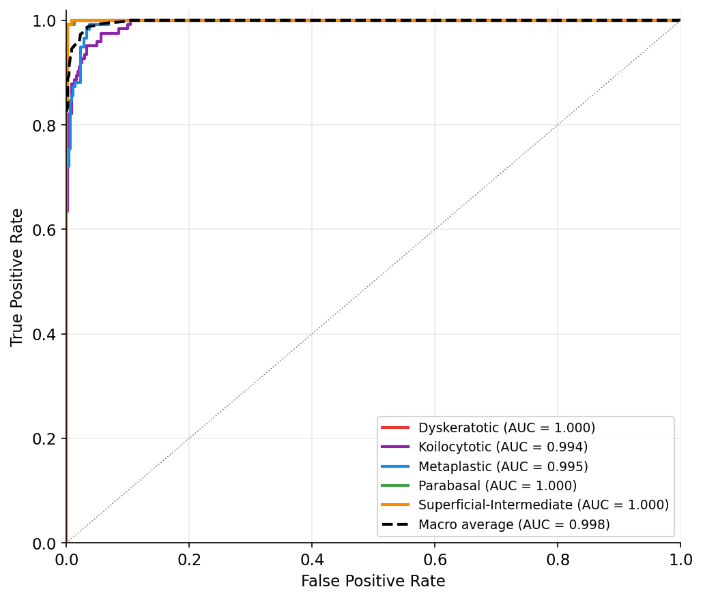

**ROC curves — One-vs-Rest.** Each colored curve shows the trade-off between True Positive Rate and False Positive Rate for one class against all others. The black dashed line is the macro-averaged ROC curve. All classes achieve AUC > 0.99, and the macro AUC is 0.9978, indicating near-perfect class separability in the model's output probability space.

---

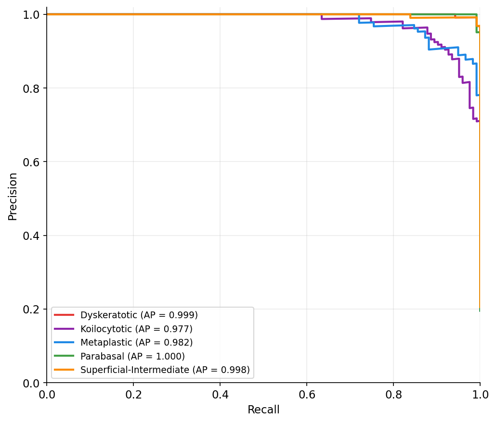

**Precision-Recall curves — One-vs-Rest.** Each curve plots Precision against Recall as the classification threshold varies, per class. High area under these curves (Average Precision ≈ 1.0 for most classes) confirms that the model maintains high precision even at high recall levels. Koilocytotic shows the largest deviation from the ideal top-right corner, consistent with its lower recall.

---

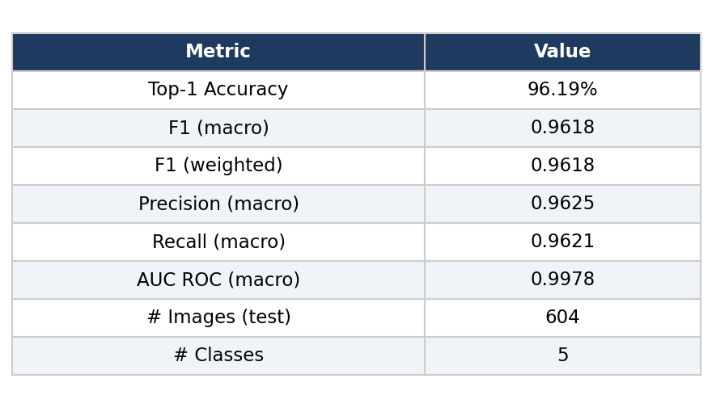

**Metrics summary table — CROPPED model.** A concise table reporting all key evaluation metrics on the 604-image test set: Top-1 accuracy, macro and weighted F1, macro precision, macro recall, and macro AUC ROC. The results confirm that GLSim with ViT-B/16 achieves strong and balanced performance across all five cervical cell classes.

---

## Experiment 2 — Full Slides (Whole Microscope Images)

Training on 966 full microscope slide images (1536×2048 px). Unlike the CROPPED experiment, each image contains multiple cells along with background tissue, staining artifacts, and overlapping cells. The same preprocessing pipeline was applied (resize 300 → center crop 224), forcing the model to learn from a compressed central view of each slide.

| Metric | Value |
|--------|-------|
| **Top-1 Accuracy** | **92.67%** |
| **F1 Score (macro)** | 0.9385 |
| **F1 Score (weighted)** | 0.9256 |
| **Precision (macro)** | 0.9377 |
| **Recall (macro)** | 0.9420 |
| **AUC ROC (macro)** | **0.9889** |

| Class | Precision | Recall | F1-Score | Support |
|-------|-----------|--------|----------|---------|
| Dyskeratotic | 0.89 | 0.97 | 0.93 | 34 |
| Koilocytotic | 0.94 | 0.81 | 0.87 | 37 |
| Metaplastic | 0.91 | 0.93 | 0.92 | 42 |
| Parabasal | 1.00 | 1.00 | 1.00 | 17 |
| Superficial-Intermediate | 0.95 | 1.00 | 0.98 | 20 |

**Best epoch:** 30/50 · **Training time:** ~116 min (~2.32 min/epoch) · **VRAM:** 4.57 GB

---

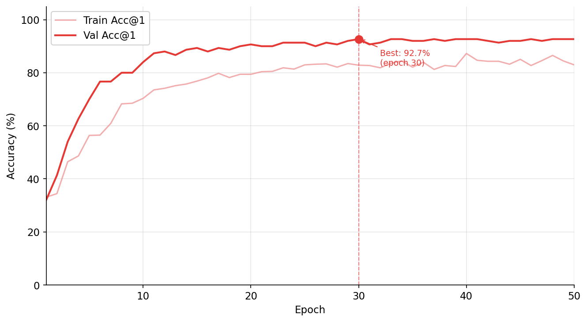

**Train vs. Validation accuracy per epoch — Full Slides model.** The red line tracks validation accuracy across 50 epochs. Despite the much smaller dataset (816 training slides vs. 3,445 CROPPED cells), the model reaches competitive accuracy quickly, peaking at epoch 30. The greater oscillation in the validation curve compared to the CROPPED model reflects the higher variability inherent in full-slide images, where the center crop may capture different cell regions across runs.

---

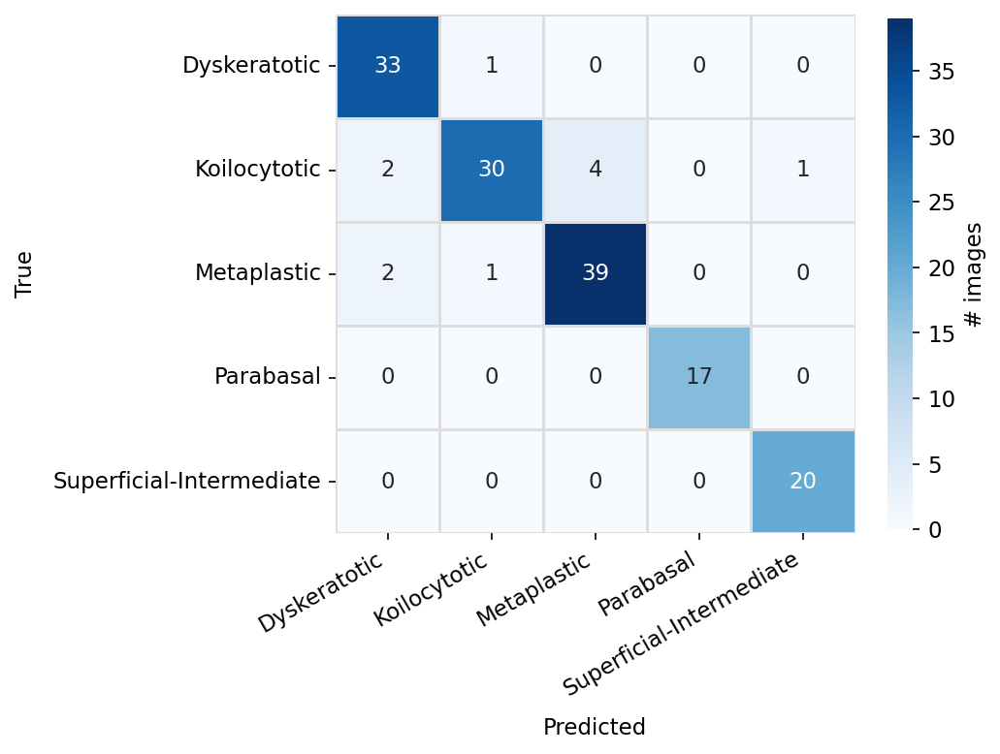

**Confusion matrix — Full Slides (absolute counts).** Evaluated on 150 held-out test slides. Most predictions fall on the diagonal, confirming that slide-level classification is feasible even without individual cell segmentation. The main source of error is between Koilocytotic and Metaplastic, which is the same pattern observed in the CROPPED experiment, suggesting this is an intrinsic inter-class ambiguity.

---

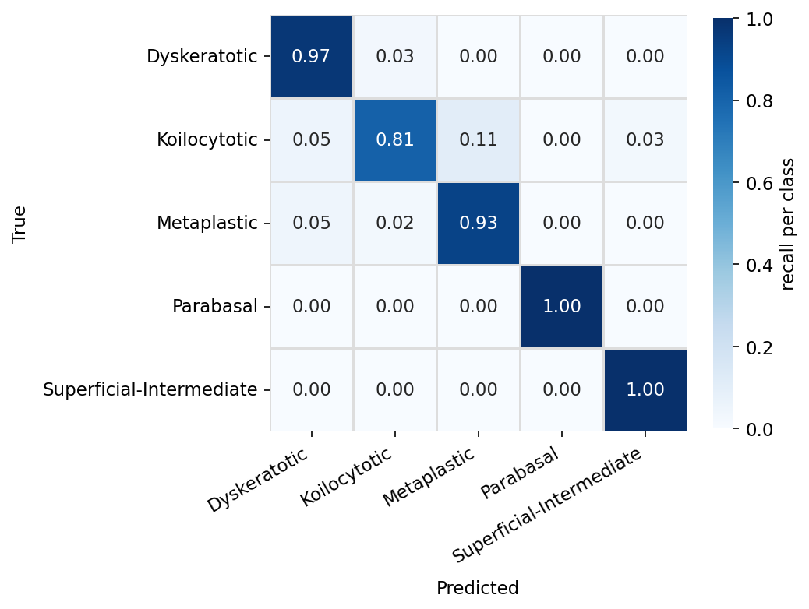

**Normalized confusion matrix — Full Slides (recall per class).** Parabasal and Superficial-Intermediate achieve near-perfect recall (1.00 and 1.00), while Koilocytotic has the lowest recall at 0.81. The normalization highlights that the model is systematically more uncertain about Koilocytotic slides, likely because the perinuclear halo that characterizes this class is a subtle feature that may not always fall within the 224×224 center crop.

---

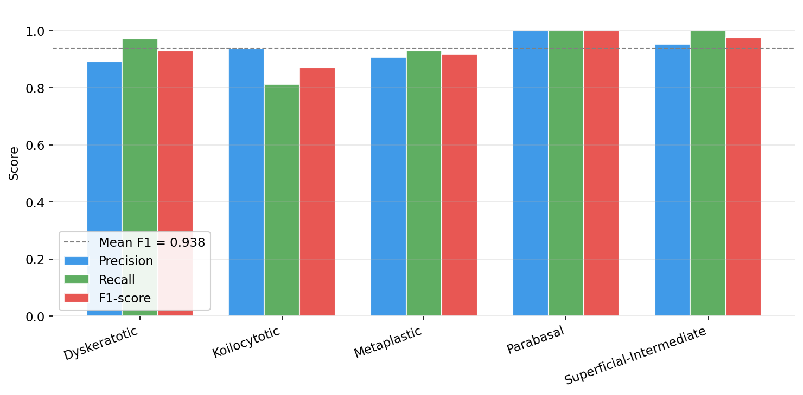

**Precision, Recall, and F1-Score per class — Full Slides.** The dashed line marks the macro-averaged F1 (0.9385). Parabasal achieves a perfect F1 of 1.00, and Superficial-Intermediate reaches 0.98. Koilocytotic has the lowest F1 (0.87), approximately 5 pp below the CROPPED model's result for the same class (0.92), reflecting the added difficulty of classifying this class from a compressed whole-slide view.

---

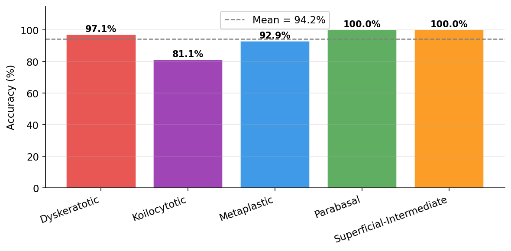

**Per-class accuracy — Full Slides.** Parabasal achieves 100% accuracy on the test set, the same result as the CROPPED model. The overall mean accuracy (dashed line) sits at 92.7%, only 3.5 pp below the CROPPED model. This result is notable given that the full-slide model was trained on 4× fewer images and on images that are far more complex than segmented cells.

---

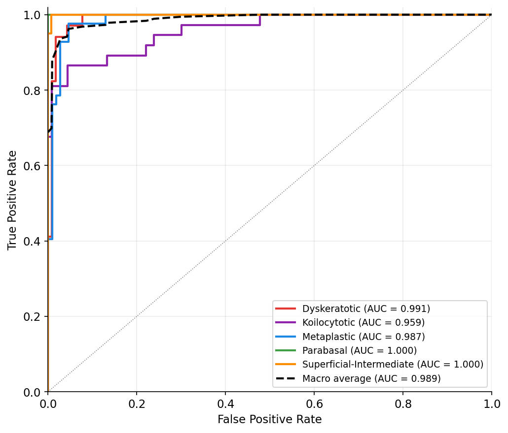

**ROC curves — Full Slides, One-vs-Rest.** The macro AUC of 0.9889 is only marginally lower than the CROPPED model's 0.9978. All five classes maintain AUC > 0.98, confirming that the model's probabilistic outputs are well-calibrated even when operating on whole slides. The slightly wider gap from the ideal (1,1) corner compared to the CROPPED model reflects the increased input complexity.

---

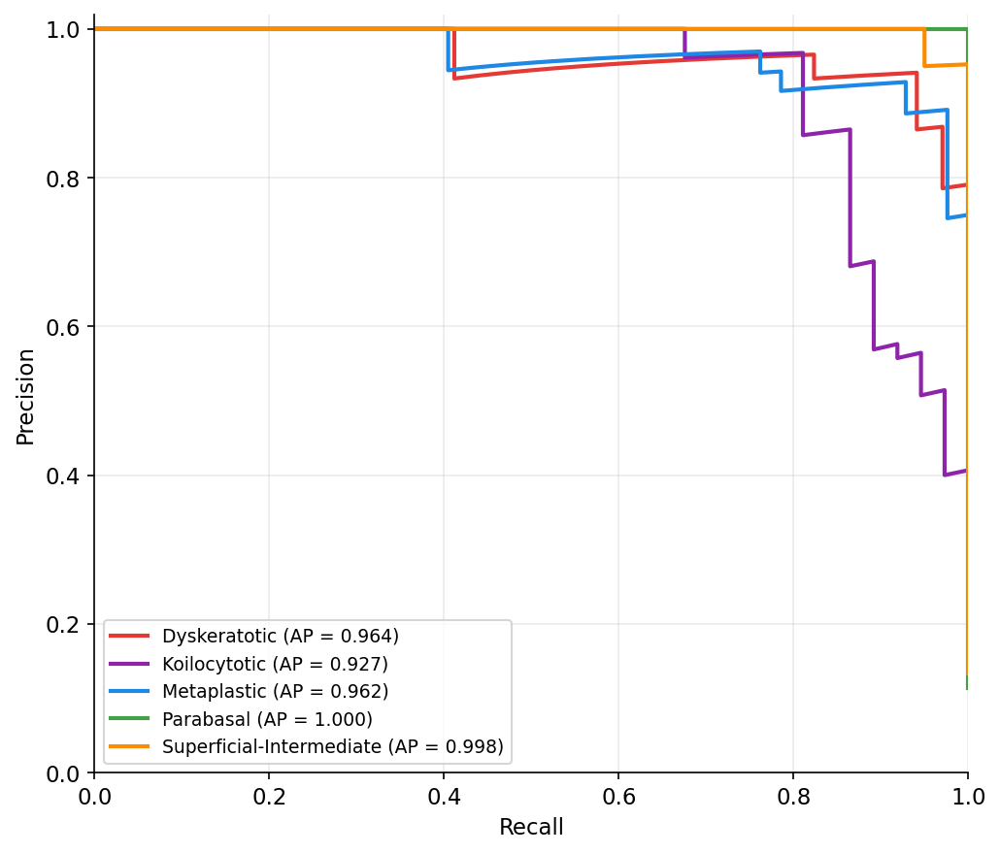

**Precision-Recall curves — Full Slides, One-vs-Rest.** High Average Precision (AP > 0.97) for most classes indicates that the full-slide model sustains high precision across all recall thresholds. The Koilocytotic curve shows the largest area deficit, consistent with the lower recall observed across all metrics for this class in both experiments.

---

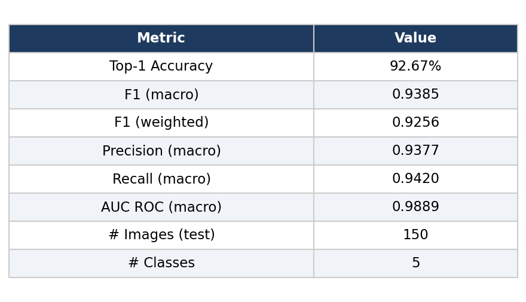

**Metrics summary table — Full Slides model.** Summarizes the five key evaluation metrics on the 150-image slides test set. Despite the smaller, more complex dataset, the model achieves competitive performance, confirming that GLSim's global-local attention mechanism is able to identify discriminative regions even within large, multi-cell microscope images.

---

## Model Comparison

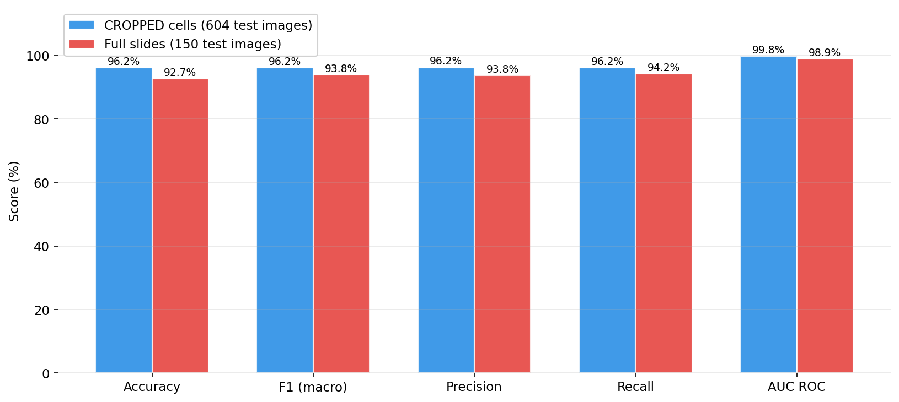

**CROPPED cells vs. Full Slides — side-by-side comparison.** Each metric is shown for both models on their respective test sets (604 CROPPED cells vs. 150 full slides). The CROPPED model consistently outperforms the slides model across all metrics, but the gap is narrow: only 3.5 pp in accuracy, 2.3 pp in F1, and 0.9 pp in AUC ROC. This demonstrates that even without individual cell segmentation, GLSim can learn discriminative slide-level representations with strong generalization.

---

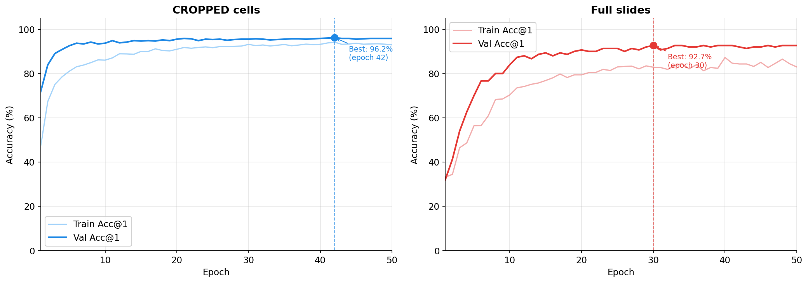

**Train vs. Validation accuracy per epoch — side-by-side comparison.** Left panel: CROPPED model (blue). Right panel: Full Slides model (red). Both models were trained for 50 epochs with the same hyperparameters. The CROPPED model converges more smoothly and to a higher plateau due to its larger, more uniform training set. The slides model shows higher variance in the validation curve but still converges to competitive accuracy. Markers indicate the best validation epoch for each run (epoch 42 for CROPPED, epoch 30 for slides).

---

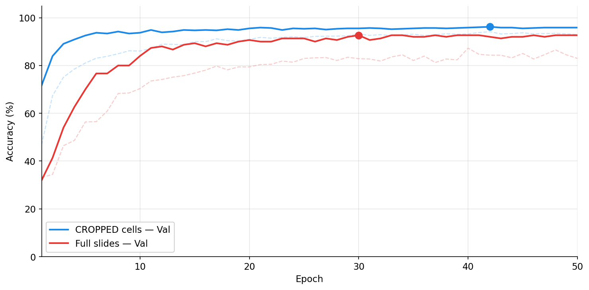

**Validation accuracy overlay — both models on the same axes.** The blue curve (CROPPED) and red curve (Full Slides) are plotted together for direct epoch-by-epoch comparison. The CROPPED model reaches higher accuracy earlier and maintains a more stable plateau. The slides model peaks earlier (epoch 30) but with more oscillation, suggesting that the smaller dataset limits further generalization beyond that point. The filled markers indicate the best checkpoint epoch for each model.

---

## Project Structure

```
cervical-cancer/
├── glsim/                        # GLSim package (model, data, training)
│   ├── model_utils/              # ViTGLSim, build_model, configs
│   ├── data_utils/               # datasets, dataloaders, transforms
│   ├── train_utils/              # trainer, loss, scheduler, scaler
│   └── other_utils/              # build_args, yaml_config_hook
│
├── configs/
│   ├── train.yaml                # Main training config
│   ├── dataset.yaml              # Dataset paths and CSV files
│   ├── methods/glsim.yaml        # GLSim architecture
│   ├── augs/medaugs.yaml         # Augmentation policy
│   └── settings/ft_is224.yaml   # Fine-tuning settings
│
├── tools/
│   └── train.py                  # Training script
│
├── im_Dyskeratotic/              # Original dataset images
├── im_Koilocytotic/
├── im_Metaplastic/
├── im_Parabasal/
├── im_Superficial-Intermediate/
│
├── train.csv                     # Generated splits
├── val.csv
├── test.csv
├── train_val.csv
├── classid_classname.csv
│
├── results_train/                # Checkpoints and TensorBoard logs
│   └── cervical_vit_b16_16_0/
│       ├── vit_b16_best.pth      # Best model (epoch 42)
│       ├── vit_b16_last.pth      # Last checkpoint (epoch 50)
│       └── tensorboard/          # TensorBoard logs
│
├── eda_output/                   # EDA plots
├── eval_output/                  # Evaluation plots (confusion matrix, ROC, etc.)
│
├── train.bat / train.sh          # Training scripts
├── tensorboard.bat               # Launch TensorBoard (http://localhost:6006)
├── dashboard.bat / dashboard.sh  # Gradio dashboard (http://localhost:7860)
├── eval.py                       # Test set evaluation with plots
├── eda.py                        # Exploratory data analysis
└── dashboard.py                  # Real-time training dashboard
```

---

## Usage

### 1. Set up the environment

```bash
conda activate RNA
pip install -r requirements.txt
```

### 2. Generate dataset splits

```bash
python tools/preprocess/prepare_cervical.py
```

### 3. Train

```bat
# Windows
train.bat [lr] [epochs] [serial]
train.bat 0.003 50 0

# WSL / Linux
bash train.sh 0.003 50 0
```

### 4. Monitor training

```bat
# TensorBoard — http://localhost:6006
tensorboard.bat

# Gradio dashboard — http://localhost:7860
dashboard.bat
```

### 5. Evaluate on test set

```bash
python eval.py
# Plots saved in eval_output/
```

### 6. Exploratory data analysis

```bash
python eda.py
# Plots saved in eda_output/
```

---

## Training Hyperparameters

### Model

| Parameter | Value |
|-----------|-------|
| `model_name` | `vit_b16` |
| `classifier` | `cls` (CLS token) |
| `hidden_size` | 768 |
| `intermediate_size` | 3072 |
| `num_hidden_layers` | 12 |
| `num_attention_heads` | 12 |
| `pos_embedding_type` | `learned` |
| `hidden_act` | `gelu` |
| `encoder_norm` | True |
| `layer_norm_eps` | 1e-12 |
| `pretrained` | True (ImageNet-21k) |

### GLSim — Global-Local Mechanism

| Parameter | Value | Description |
|-----------|-------|-------------|
| `anchor_size` | 16 | Local crop size (patch size) |
| `num_anchors` | 1 | Number of crops per image |
| `sim_metric` | `cos` | Cosine similarity between CLS and patches |
| `dynamic_anchor` | True | Dynamic bounding box from top-K |
| `dynamic_top` | 8 | Top-8 most similar patches |
| `anchor_class_token` | True | Dedicated CLS token for crop |
| `reducer` | `cls` | Reduces sequence via CLS token |
| `aggregator` | True | Transformer aggregator for global+local |
| `aggregator_num_hidden_layers` | 1 | Aggregator layers |
| `aggregator_norm` | True | LayerNorm after aggregator |
| `representation_size` | 768 | Representation dimension |
| `seq_len_post_reducer` | 2 | Sequence length after reducer |

### Optimization

| Parameter | Value |
|-----------|-------|
| `opt` | `sgd` |
| `lr` | 0.003 |
| `momentum` | 0.9 |
| `weight_decay` | 0.0 |
| `clip_grad` | 1.0 |
| `sched` | `cosine` |
| `warmup_lr` | 1e-6 |
| `min_lr` | 1e-5 |
| `warmup_steps` | 500 |
| `warmup_epochs` | 2 |
| `cooldown_epochs` | 5 |
| `decay_rate` | 0.1 |
| `epochs` | 50 |
| `batch_size` | 16 |
| `gradient_accumulation_steps` | 1 |
| `effective_batch_size` | 16 |
| `fp16` | True (AMP) |

### Loss

| Parameter | Value |
|-----------|-------|
| `ls` | True (Label Smoothing) |
| `smoothing` | 0.1 |
| `focal_gamma` | 0.0 (not used) |

### Augmentation (Training)

| Parameter | Value |
|-----------|-------|
| `image_size` | 224 × 224 px |
| `resize_size` | 300 × 300 px |
| `square_resize_random_crop` | True |
| `horizontal_flip` | True |
| `trivial_aug` | True (TrivialAugmentWide) |
| `re` | 0.3 (Random Erasing, 30% prob.) |
| `re_sh` | 0.4 (max erased area) |
| `sd` | 0.1 (Stochastic Depth) |
| `hidden_dropout_prob` | 0.1 |
| `attention_probs_dropout_prob` | 0.0 |

### Augmentation (Validation / Test)

| Parameter | Value |
|-----------|-------|
| `resize_size` | 300 × 300 px |
| `center_crop` | 224 × 224 px |
| Normalization | mean=(0.485, 0.456, 0.406), std=(0.229, 0.224, 0.225) |

---

## Hardware Configuration

| Component | Specification |
|-----------|---------------|
| **CPU** | Intel Core (laptop) |
| **GPU** | NVIDIA GeForce RTX 3050 Laptop — 6 GB VRAM |
| **NVIDIA Driver** | 596.08 |
| **CUDA (driver)** | 13.2 |
| **OS** | Windows 11 + WSL2 (Ubuntu) |
| **WSL Kernel** | 6.18.33.1-microsoft-standard-WSL2 |

---

## Software Environment

| Package | Version |
|---------|---------|
| **Python** | 3.10.20 |
| **PyTorch** | 2.5.1 |
| **CUDA (PyTorch)** | 12.1 |
| **timm** | 0.9.12 |
| **einops** | — |
| **scikit-learn** | 1.7.2 |
| **scipy** | 1.15.3 |
| **numpy** | 2.2.6 |
| **pandas** | 2.3.3 |
| **matplotlib** | 3.10.9 |
| **seaborn** | 0.13.2 |
| **plotly** | 6.8.0 |
| **gradio** | 6.14.0 |
| **opencv-python** | 4.13.0 |
| **tensorboard** | 2.20.0 |
| **umap-learn** | — |
| **wandb** | 0.26.1 (disabled) |
| **Conda env** | `RNA` (miniconda3) |

---

## Generated Outputs

### `results_train/cervical_vit_b16_16_0/`
- `vit_b16_best.pth` — best model (epoch 42, 96.19%)
- `vit_b16_last.pth` — last checkpoint (epoch 50)
- `tensorboard/` — training logs (loss, accuracy, lr per epoch)

### `eval_output/`
- `confusion_matrix.png` — absolute confusion matrix
- `confusion_matrix_normalized.png` — normalized by recall
- `precision_recall_f1.png` — precision, recall and F1 per class
- `accuracy_per_class.png` — per-class accuracy
- `roc_curves.png` — ROC curves one-vs-rest (macro AUC = 0.9978)
- `precision_recall_curves.png` — PR curves one-vs-rest
- `metrics_summary_table.png` — metrics summary table
- `classification_report.csv` — full sklearn classification report
- `predictions.csv` — per-image predictions
- `confusion_matrix.csv` — confusion matrix as CSV

### `eda_output/`
- `01_class_distribution.png` — class distribution (bar + pie)
- `02_sample_images.png` — visual samples from all 5 classes
- `03_image_sizes.png` — image dimension distribution
- `04_rgb_distributions.png` — RGB mean/std distributions
- `05_color_histograms.png` — color histograms per class
- `06_boxplot_Mean_RGB_by_Class.png` — RGB boxplots per class
- `06_boxplot_Brightness_Contrast_Saturation.png` — brightness/contrast/saturation boxplots
- `07_correlation_matrix.png` — Pearson correlation matrix
- `08_correlation_with_class.png` — feature correlation with class_id
- `09_pca.png` — PCA 2D colored by class
- `10_pca_variance.png` — cumulative explained variance
- `11_tsne.png` — t-SNE 2D by class
- `12_umap.png` — UMAP 2D by class
- `13_anova.png` — ANOVA test per feature (F-stat + p-value)
- `14_statistics_table.png` — statistics table per class
- `15_pairplot.png` — pairplot of color and texture features
- `features.csv` — extracted features (4,049 × 20)
- `anova_results.csv` — ANOVA results per feature
